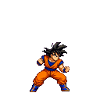
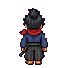
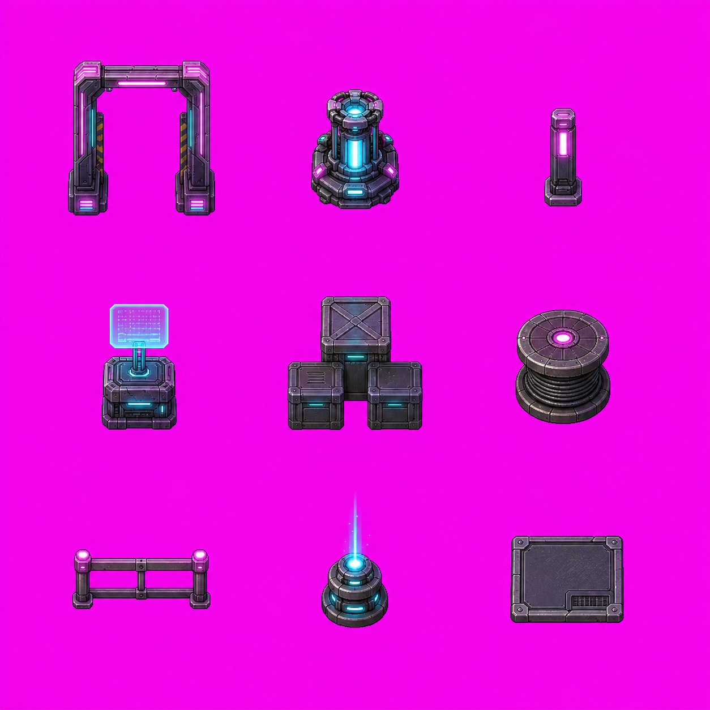
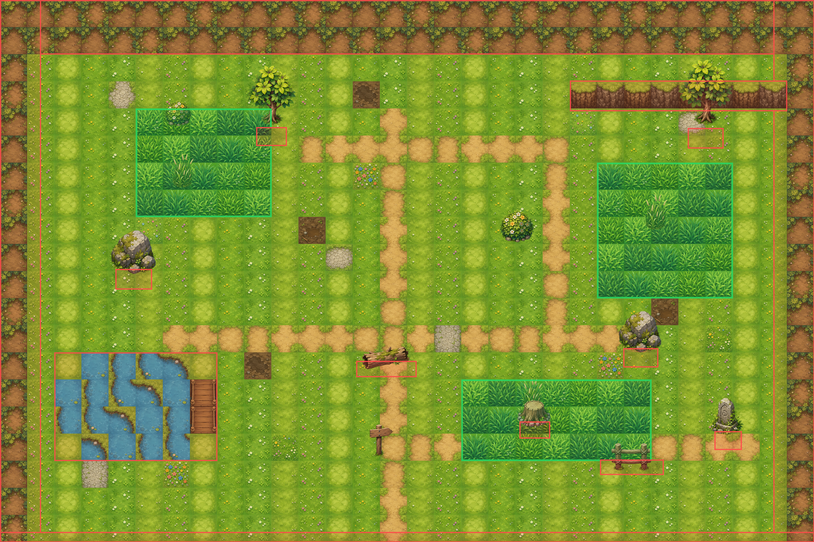
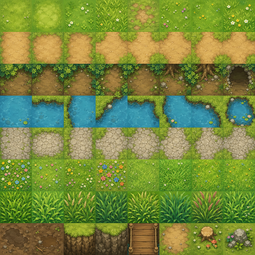

# Agent Sprite Forge

English README: [README.md](./README.md)


> 把自然語言需求直接變成可用於遊戲的 2D sprite 與分層 2D 地圖。
>
> 由 agent 規劃資產，由 Codex 生圖，再由本地 processor 輸出乾淨的透明 sheet、GIF、地圖、props 與可接碰撞資料的場景。

## Showcase

### 文字到 Sprite

<table>
  <tr>
    <td align="center" width="33%">
      
      <br />
      <strong>悟空使用龜派氣功</strong>
      <br />
      <code>help me to use $generate2dsprite to create a goku is attacking with Kamehameha</code>
    </td>
    <td align="center" width="33%">
      
      <br />
      <strong>鳴人使用螺旋丸</strong>
      <br />
      <code>使用 $generate2dsprite 幫我做一個鳴人使用螺旋丸的元素</code>
    </td>
  </tr>
</table>

### Spell Bundle / Cast、Projectile、Impact

<table>
  <tr>
    <td align="center" width="33%">
      
      <br />
      <strong>Cast</strong>
    </td>
    <td align="center" width="33%">
      
      <br />
      <strong>Projectile</strong>
    </td>
    <td align="center" width="33%">
      
      <br />
      <strong>Impact</strong>
    </td>
  </tr>
</table>

Prompt：

```text
Use  $generate2dsprite to create a fire mage cast animation with projectile and impact.
```

### Game Sprite / 四方向行走

<table>
  <tr>
    <td align="center" width="25%">
      
      <br />
      <strong>下</strong>
    </td>
    <td align="center" width="25%">
      
      <br />
      <strong>左</strong>
    </td>
    <td align="center" width="25%">
      
      <br />
      <strong>右</strong>
    </td>
    <td align="center" width="25%">
      
      <br />
      <strong>上</strong>
    </td>
  </tr>
</table>

Prompt：

```text
Use Generate 2D Sprite to create a top-down 4x4 player_sheet for a wandering young samurai with a red scarf and short katana.
Make a four-direction walk sprite sheet with 4 frames per direction.
Row order: down, left, right, up.
Same character, same outfit, same proportions, same pixel scale in every frame.
Solid #FF00FF background.
Each frame must fit fully inside its cell, with clear margin on all sides.
Retro JRPG pixel-art style.
```

### 參考圖到 Sprite

<table>
  <tr>
    <td align="center" width="35%">
      
      <br />
      <strong>參考圖</strong>
    </td>
    <td align="center" width="65%">
      
      <br />
      <strong>生成結果</strong>
      <br />
      <code>幫我使用 $generate2dsprite 做一個這隻鱷魚玩手上石頭的元素</code>
    </td>
  </tr>
  <tr>
    <td align="center" width="35%">
      
      <br />
      <strong>參考圖</strong>
    </td>
    <td align="center" width="65%">
      
      <br />
      <strong>生成結果</strong>
      <br />
      <code>Use  $generate2dsprite to create this male character teaching.</code>
    </td>
  </tr>
</table>

### Codex 一次到位的可玩遊戲

完全由 Codex 在單一 prompt 內規劃並完成的可玩遊戲。sprites 與 props 透過 `$generate2dsprite` 生成；當遊戲需要結構化地圖時，地圖場景由 `$generate2dmap` 規劃。

#### Neon Breach — 賽博龐克橫向捲軸

<p align="center">
  
</p>

Prompt:

```text
use $generate2dsprite to create a 2D side-scrolling game similar to Mega Man. It should include attack mechanics, map elements, and all the essential features. I would like you to design it, and all the necessary assets should be created using this skill. It needs to be an actually playable game, with a cyberpunk story setting.
```

#### 晴嵐御魂錄 — 戰國時代的 Pokémon-like

<table>
  <tr>
    <td align="center" width="50%">
      
      <br />
      <strong>初始御魂選擇</strong>
    </td>
    <td align="center" width="50%">
      
      <br />
      <strong>戰鬥場景</strong>
    </td>
  </tr>
</table>

Prompt:

```text
Use $generate2dsprite to create a 2D game similar to Pokemon. You only need to build one scene for now. It must include a starter monster selection mechanic, a battle screen, and all basic gameplay functions. I would like you to design all the elements and the story, and you can also decide which game engine to use. Use this skill to create any assets you need. The story should be set in the Sengoku period. Can you try putting this together for me?
Please also pay attention to the size of the elements (the generated sprites need to be proportionally correct when placed into the game), and a game map must be generated as well. Basically, just help me make a game like this—I believe you won't have any problem doing this with that skill! Just one scene is enough, and there's no need for too many monster characters. Let's just start with a few, and we can slowly expand on it later!
```

### 分層 RPG 地圖 / Clean HD Reference Pipeline

`$generate2dmap` 現在會把地圖視為一個 production pipeline，而不是單純四選一的策略。它會選擇 visual model、runtime object model、collision model、art direction 和 export target。對分層 raster map 來說，預設會使用乾淨、手繪感的 HD game-map style 來提高可讀性，先生成 ground-only base map，再把這張 base 顯示在對話中作為 wrapper reference，生成 dressed planning pass，接著把小型 props 批次做成 3x3 prop pack，切割成透明 props，寫入 y-sort placement metadata，最後合成 flattened preview。

<table>
  <tr>
    <td align="center" width="33%">
      
      <br />
      <strong>Ground-only base map</strong>
    </td>
    <td align="center" width="33%">
      
      <br />
      <strong>Dressed reference pass</strong>
    </td>
    <td align="center" width="33%">
      
      <br />
      <strong>3x3 generated prop pack</strong>
    </td>
  </tr>
</table>

<p align="center">
  
  <br />
  <strong>Flattened layered RPG map preview</strong>
</p>

Pipeline：

```text
layered_raster + y_sorted_props + precise_shapes + trigger_zones + raw_canvas
```

使用 reference 的分層地圖流程：

1. 先選 art direction：預設用 `clean_hd` 產出可讀性高的遊戲地圖；需要柔和像素感時用 `pixel_inspired`；只有使用者明確要求復古 pixel art 時才用 `retro_pixel`。
2. 先生成 ground-only base map。
3. 把 base map 顯示在對話上下文，再根據它生成 dressed reference。
4. 依 dressed reference 生成單張 props，或生成有足夠留白的 prop pack。
5. 如果有洋紅邊，先用 soft-matte chroma-key cleanup 加 despill，再切出透明 props。
6. 最終 runtime preview 由原始 base map 加上切好的透明 props 合成。

### Godot 可調整 TileMap 匯出

`$generate2dmap` 也可以輸出可在 Godot 裡調整的地圖工程，而不是只給一張 flattened 圖。這個 showcase 使用 image-generated tileset 和 3x3 prop sheet，接到 Godot 4.5 scene，產出可編輯的 `TileMapLayer`、分離式 prop sprites、遇怪草叢 `Area2D`、碰撞 `StaticBody2D`、出口區、metadata JSON，以及可立即開場景檢查的 debug player/camera。

Prompt：

```text
幫我使用 Generate 2D Map 生成一個2d rpg的遊戲地圖, 要有分開的Props, 包含遇怪獸的草叢, 連接Godot遊戲引擎，做完之後要可以開啟godot進行所有的元素調整
```

<p align="center">
  
  <br />
  <strong>Godot editor scene：可調整 layers、props、zones、collision、exits 與 debug player</strong>
</p>

<table>
  <tr>
    <td align="center" width="50%">
      
      <br />
      <strong>Layered map preview</strong>
    </td>
    <td align="center" width="50%">
      
      <br />
      <strong>Collision and zone debug overlay</strong>
    </td>
  </tr>
  <tr>
    <td align="center" width="50%">
      
      <br />
      <strong>Image-generated tileset atlas</strong>
    </td>
    <td align="center" width="50%">
      
      <br />
      <strong>3x3 generated prop pack</strong>
    </td>
  </tr>
</table>

Godot 輸出包含：

- 可調整的 `TileMapLayer`：ground、water/bridge、decor、encounter grass、obstacles。
- `YSorted_SeparateProps` 裡的獨立 `Sprite2D` props。
- 帶 encounter table 的遇怪草叢 `Area2D` zones。
- 邊界、水域、斷崖與 prop base 的 `StaticBody2D` collision blockers。
- 用於路線轉場的出口 `Area2D` zones。
- 可立即開場景測試的 `CharacterBody2D` debug player 與 camera。

Pipeline：

```text
image_gen tileset + prop_pack_3x3 + layered_tilemap + separate_props + trigger_zones + Godot_TileMap
```

這是一組以 Codex 為核心的 2D game asset skills，用來產出可直接拿去做遊戲資產與可玩地圖場景的 2D sprites、props、FX 與地圖。

這個 repo 目前提供兩個 skills：

- [`skills/generate2dsprite`](./skills/generate2dsprite)：生成並後處理 sprites、動畫 sheets、props 與 FX。
- [`skills/generate2dmap`](./skills/generate2dmap)：選擇 2D map pipeline，生成 base map 或 prop pack，切出透明 props，合成 preview，並產出 collision / zones metadata。

`$generate2dmap` 只有在選定的地圖 pipeline 需要可重用透明 props 時，才會使用 `$generate2dsprite`。小型環境物件可以批次生成為 `2x2`、`3x3` 或 `4x4` prop pack，再切成個別透明 props。簡單地圖可以維持單張 baked image。

當流程需要視覺 reference 時，兩個 skills 都遵守同一個 wrapper 規則：先讓圖片出現在對話上下文。使用者上傳的圖片與剛生成的圖片已經在上下文中；local file 則先用 `view_image` 打開，再要求內建 image generation 保留角色 identity、風格、地圖 layout 或 sprite 進化脈絡。

之所以先以 Codex 為主，是因為 Codex 本身就有內建 image generation，所以整個流程可以留在同一個 agent 內完成：

1. 由 agent 規劃資產類型、動畫形式或地圖 pipeline。
2. 由 Codex 生成 raw sprite sheet、prop 或 map image。
3. 由本地 processor 做去背、切格、對齊、基本 QC，最後輸出透明 PNG / GIF。
4. 需要時組裝地圖場景，包含 collision、zones、prop placement、prop-pack manifest 與 preview image。

目前這個 repo 的重點是 2D 遊戲資產與地圖場景，不是整包遊戲 pack 自動化。

## 可以生成什麼

- Creature
- Character
- Player / NPC
- Spell cast
- Projectile
- Impact / explosion
- FX sheet
- 小型 bundle，例如 `unit_bundle`、`spell_bundle`、`combat_bundle`
- 依 reference 生成的 sprite 變體、動畫 sheet 與進化線
- 單張 baked 2D map
- clean HD 手繪風分層地圖
- base map + 透明 props 的分層地圖
- 依 dressed reference 規劃 props 擺放的分層地圖
- `2x2`、`3x3`、`4x4` 這類 2D map prop pack
- 可玩地圖用的 collision / zone metadata
- 給 QA 與 showcase 用的 flattened map preview
- Godot 可開啟調整的地圖工程，包含 `TileMapLayer`、分離式 props、`Area2D` 遇怪草叢、`StaticBody2D` 碰撞、出口區與 debug player scene

## 為什麼先做 Codex 版本

因為 Codex 可以直接在同一個工作流內生圖，流程會乾淨很多：

- 不需要另外接 image API
- 不需要額外的 prompt builder service
- 不需要獨立 sprite backend
- 由同一個 agent 規劃資產
- 由本地 processor 負責可重現的後處理

這個 repo 的設計理念是：

- 美術規劃交給 agent
- 去背、切圖、對齊、輸出交給 deterministic processor

也就是說，agent 會決定：

- asset type
- action type
- bundle shape
- sheet layout
- frame count
- alignment strategy
- detached effects 要不要保留

Python script 不負責創意判斷，只負責穩定執行像素層級的處理。

## Repo 結構

```text
agent-sprite-forge/
  README.md
  README.zh-TW.md
  requirements.txt
  src/
  skills/
    generate2dmap/
      SKILL.md
      agents/
        openai.yaml
      references/
        layered-map-contract.md
        map-strategies.md
        prop-pack-contract.md
      scripts/
        compose_layered_preview.py
        extract_prop_pack.py
    generate2dsprite/
      SKILL.md
      agents/
        openai.yaml
      references/
        modes.md
        prompt-rules.md
      scripts/
        generate2dsprite.py
```

## 安裝方式

### Option 1: Windows PowerShell

先 clone repo，安裝本地 processor 依賴，再把兩個 skills 複製到 Codex skills 目錄：

```powershell
git clone https://github.com/0x0funky/agent-sprite-forge.git
cd .\agent-sprite-forge
python -m pip install -r .\requirements.txt
New-Item -ItemType Directory -Force -Path "$env:USERPROFILE\.codex\skills" | Out-Null
Copy-Item -Recurse -Force `
  ".\skills\*" `
  "$env:USERPROFILE\.codex\skills\"
```

### Option 2: macOS / Linux

```bash
git clone https://github.com/0x0funky/agent-sprite-forge.git
cd ./agent-sprite-forge
python3 -m pip install -r ./requirements.txt
mkdir -p ~/.codex/skills
cp -R ./skills/* ~/.codex/skills/
```

安裝完後建議重新開一個新的 Codex session，讓 skill 重新載入。

## Python 依賴

本地後處理目前依賴：

- `Pillow`
- `numpy`

這些都列在 [`requirements.txt`](./requirements.txt)。

雖然 Codex 本身負責生圖，但你還是需要這些 Python 套件來完成：

- 洋紅背景去背
- 切格
- 主體 bbox 偵測
- 對齊與縮放
- 透明 PNG / GIF 輸出

## 建議 Prompt

### 基本用法

```text
Use  $generate2dsprite to create a 3x3 idle for an ultimate earth titan.
```

```text
Use  $generate2dsprite to create a side-view lightning knight attack animation.
```

```text
Use  $generate2dsprite to create a late-Sengoku player_sheet for a wandering fire swordsman.
```

### Spell / FX

```text
Use  $generate2dsprite to create a wizard spell bundle with cast, projectile, and impact sprites.
```

```text
Use  $generate2dsprite to create a fireball projectile loop and a matching explosion impact.
```

```text
Use  $generate2dsprite to create a side-view summon entrance effect for a thunder wolf spirit.
```

### Character / Monster 範例

```text
Use  $generate2dsprite to create Omegamon attack and right-move animation assets.
```

```text
Use  $generate2dsprite to create a golden divine boar 2x2 idle animation.
```

```text
Use  $generate2dsprite to create a Naruto-style rasengan cast sheet in 2x3.
```

### 地圖範例

```text
Use $generate2dmap to create a small fixed-screen pixel-art battle arena with simple collision.
```

```text
Use $generate2dmap to create a top-down RPG forest shrine map. Use a layered raster pipeline, a 3x3 prop pack for small environmental props, precise collision, encounter grass zones, a rest point, and actors that can walk in front of and behind tall props.
```

```text
Use $generate2dmap to revise this existing map into a layered raster map. Keep the background baked, but split the gate and lanterns into reusable transparent props with y-sort placement metadata.
```

## 會輸出什麼

一般 sheet 類型的輸出通常包含：

- `raw-sheet.png`
- `raw-sheet-clean.png`
- `sheet-transparent.png`
- frame PNG
- `animation.gif`
- `prompt-used.txt`
- `pipeline-meta.json`

如果是 player walk sheet，通常還會額外輸出各方向 strip 與各方向 GIF。

如果是地圖輸出，結果會依選擇的 pipeline 而定：

- 單張 baked map：完整地圖圖檔、可選的 prompt file，以及可選的 collision metadata。
- Layered raster map：base map、生成出的 prop folders 或 prop-pack extraction manifest、prop 擺放資料、collision/zones metadata，以及 flattened layered preview。

## 備註

- Prompt 越清楚，結果通常越穩。最好明確描述視角、動作、動畫型態與尺寸。
- 大型 creature 通常比較適合 `3x3 idle`。
- 小型 spell / projectile 通常比較適合 `1x4`、`2x2` 或 `2x3`。
- 如果要商用，建議優先使用原創角色或你自己持有權利的 IP。

## Star History

<a href="https://www.star-history.com/?repos=0x0funky%2Fagent-sprite-forge&type=date&legend=top-left">
 <picture>
   <source media="(prefers-color-scheme: dark)" srcset="https://api.star-history.com/chart?repos=0x0funky/agent-sprite-forge&type=date&theme=dark&legend=top-left" />
   <source media="(prefers-color-scheme: light)" srcset="https://api.star-history.com/chart?repos=0x0funky/agent-sprite-forge&type=date&legend=top-left" />
   
 </picture>
</a>

## 授權

MIT。請見 [LICENSE](./LICENSE)。
